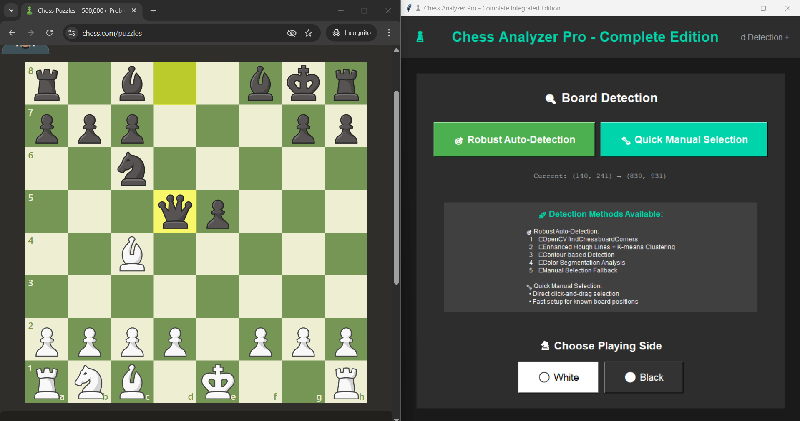
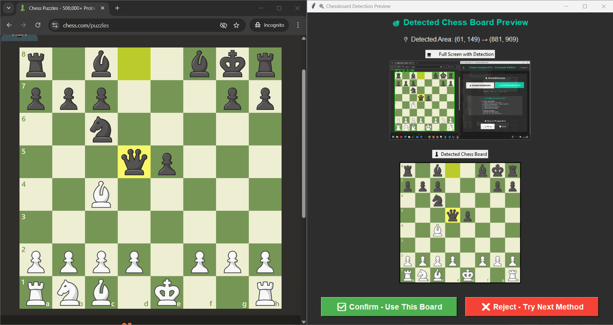
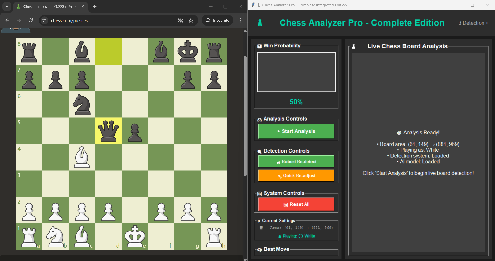
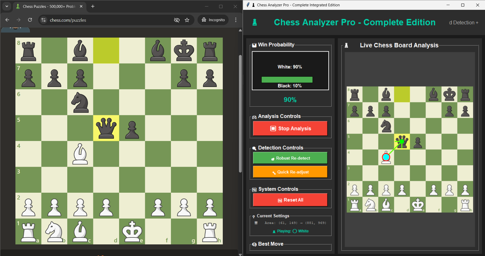

# ♟️ Chess Analyser Pro

**Chess Analyser Pro** is a machine learning–powered chess board analyzer that detects chess pieces from images/screenshots and predicts the board position. It uses a trained **PyTorch CNN model** to recognize individual chess pieces and reconstructs the full board layout.

---

## 🚀 Features
- Detects chess pieces from images.
- Classifies pieces (pawn, rook, knight, bishop, queen, king — both black & white).
- Provides board state in FEN-like format.
- Includes dataset and training pipeline for custom training.
- Easy-to-run inference with pre-trained model.

---

## 📂 Project Structure
```
Chess_Analyser_Pro/
│── chess_analyser_pro.py   # Main analyser script
│── train.py                # Model training script
│── test.py                 # Model evaluation script
│── split.py                # Dataset split utility
│── chess_piece_model.pth   # Pre-trained PyTorch model
│── class_order.json        # Piece label mapping
│── dataset/                # Chess piece images
│    ├── bB/ ...            # Example: black bishop images
│    ├── wP/ ...            # Example: white pawn images
│    └── ...
```
---

## 🛠 Requirements
Install dependencies using:

```bash
pip install -r requirements.txt
```

### requirements.txt
```
torch
torchvision
numpy
opencv-python
matplotlib
scikit-learn
tqdm
psutil
Pillow
python-chess
```

---

## ▶️ Usage

### 1. Create a "DataSet" named folder

### 2. Split dataset (train/val/test)
```bash
python split.py --dataset dataset/ --output split_dataset/
```

### 3. Train the model
```bash
python train.py --dataset dataset/ --epochs 20 --batch-size 32
```

### 4. Test the model
```bash
python test.py --model chess_piece_model.pth
```

### 5. Run the analyser
```bash
python chess_analyser_pro.py --image path/to/chessboard.png
```


## 📊 Dataset
- Images are organized by class (`wP`, `bK`, `wQ`, etc.).
- You can extend dataset with your own chess piece images.

---

## 🧠 Model
- CNN model implemented in PyTorch.
- Supports retraining with custom data.
- Saves model in `.pth` format.

---
## 🧠 Project UI - DEMO

Set-up Screen


Robust Dection


Main Menu


Running Product



## 📜 License
MIT License.  
You are free to use, modify, and distribute this project.
